# Diagram Architektury Autentykacji - 10xCards

Ten diagram przedstawia pełny przepływ autentykacji w aplikacji 10xCards wykorzystującej Nuxt 3 i Supabase Auth.

```mermaid
sequenceDiagram
    autonumber
    
    participant U as Użytkownik
    participant B as Przeglądarka
    participant M as Middleware Nuxt
    participant API as Nuxt API
    participant SA as Supabase Auth
    
    Note over U,SA: Inicjalizacja aplikacji
    
    U->>B: Otwiera aplikację
    activate B
    B->>B: Ładuje plugin auth.client.ts
    B->>SA: Pobierz sesję z localStorage
    SA-->>B: Zwraca sesję lub null
    
    alt Sesja istnieje
        B->>B: Ustaw stan użytkownika
        Note over B: useAuth().user = user
    else Brak sesji
        B->>B: Ustaw stan niezalogowany
        Note over B: useAuth().user = null
    end
    
    deactivate B
    
    Note over U,SA: Scenariusz rejestracji
    
    U->>B: Wchodzi na /auth/register
    activate B
    B->>M: Sprawdź middleware guest
    activate M
    
    alt Użytkownik zalogowany
        M-->>B: Przekieruj do /generate
    else Użytkownik niezalogowany
        M-->>B: Pozwól na dostęp
    end
    
    deactivate M
    B->>U: Wyświetl formularz rejestracji
    U->>B: Wypełnia email i hasło
    B->>B: Walidacja client-side
    
    alt Walidacja niepomyślna
        B-->>U: Wyświetl błędy walidacji
    else Walidacja pomyślna
        B->>SA: signUp(email, password)
        activate SA
        SA->>SA: Tworzy użytkownika w auth.users
        
        par Wysłanie emaila weryfikacyjnego
            SA->>SA: Generuj link weryfikacyjny
            SA-->>U: Wyślij email weryfikacyjny
        and Zwrot odpowiedzi
            SA-->>B: Zwraca wynik rejestracji
        end
        
        deactivate SA
        
        alt Rejestracja pomyślna
            B->>B: Aktualizuj stan użytkownika
            B-->>U: Komunikat o weryfikacji emaila
        else Błąd rejestracji
            B->>B: Mapuj błąd na polski
            B-->>U: Wyświetl komunikat błędu
        end
    end
    
    deactivate B
    
    Note over U,SA: Scenariusz logowania
    
    U->>B: Wchodzi na /auth/login
    activate B
    B->>M: Sprawdź middleware guest
    activate M
    M-->>B: Pozwól na dostęp (niezalogowany)
    deactivate M
    
    B->>U: Wyświetl formularz logowania
    U->>B: Wprowadza email i hasło
    B->>B: Walidacja client-side
    
    B->>SA: signInWithPassword(email, password)
    activate SA
    SA->>SA: Weryfikuj dane logowania
    
    alt Dane poprawne
        SA->>SA: Generuj JWT token
        SA-->>B: Zwraca user + session + access_token
        B->>B: Zapisz sesję w localStorage
        B->>B: Aktualizuj useAuth() stan
        B-->>U: Przekieruj do /generate
    else Dane niepoprawne
        SA-->>B: Zwraca błąd invalid_credentials
        B->>B: Mapuj na "Nieprawidłowy email lub hasło"
        B-->>U: Wyświetl komunikat błędu
    end
    
    deactivate SA
    deactivate B
    
    Note over U,SA: Dostęp do chronionej trasy
    
    U->>B: Próbuje wejść na /generate
    activate B
    B->>M: Sprawdź middleware auth
    activate M
    M->>M: Sprawdź useAuth().isAuthenticated
    
    alt Użytkownik zalogowany
        M-->>B: Pozwól na dostęp
        B->>U: Wyświetl stronę /generate
    else Użytkownik niezalogowany
        M-->>B: Przekieruj do /auth/login?redirect=/generate
        B-->>U: Przekierowanie do logowania
    end
    
    deactivate M
    deactivate B
    
    Note over U,SA: Wywołanie chronionego API
    
    U->>B: Generuje fiszki (klik przycisku)
    activate B
    B->>B: useApi().apiFetch('/api/generations')
    B->>B: Pobierz token z useAuth().getAccessToken()
    B->>API: POST /api/generations + Authorization: Bearer JWT
    activate API
    
    API->>API: getUserId(event) - weryfikacja tokenu
    API->>SA: Weryfikuj JWT token
    activate SA
    SA->>SA: Sprawdź ważność tokenu
    
    alt Token ważny
        SA-->>API: Zwraca user.id
        API->>API: Wykonaj operację z user_id
        Note over API: RLS policies automatycznie filtrują dane
        API-->>B: Zwraca wynik operacji
        B-->>U: Wyświetl wygenerowane fiszki
    else Token nieważny lub wygasły
        SA-->>API: Błąd weryfikacji
        API-->>B: HTTP 401 Unauthorized
        B->>B: useAuth() wykrywa błąd 401
        B->>B: Wyczyść sesję użytkownika
        B-->>U: Przekieruj do /auth/login
    end
    
    deactivate SA
    deactivate API
    deactivate B
    
    Note over U,SA: Automatyczne odświeżanie tokenu
    
    B->>SA: Supabase SDK wykrywa zbliżające się wygaśnięcie
    activate SA
    SA->>SA: Automatyczne odświeżenie tokenu
    
    alt Odświeżenie pomyślne
        SA-->>B: Nowy access_token
        B->>B: Aktualizuj sesję w localStorage
        Note over B: Użytkownik nie zauważa procesu
    else Odświeżenie niepomyślne
        SA-->>B: Event SIGNED_OUT
        B->>B: useAuth() czyści stan użytkownika
        B->>B: Wyczyść localStorage
        B-->>U: Przekieruj do /auth/login
    end
    
    deactivate SA
    
    Note over U,SA: Wylogowanie
    
    U->>B: Klik "Wyloguj" w nawigacji
    activate B
    B->>SA: signOut()
    activate SA
    SA->>SA: Zakończ sesję użytkownika
    SA-->>B: Potwierdzenie wylogowania
    deactivate SA
    
    B->>B: Wyczyść useAuth() stan
    B->>B: Wyczyść localStorage
    B-->>U: Przekieruj do /auth/login
    deactivate B
    
    Note over U,SA: Synchronizacja między zakładkami
    
    par Zakładka 1
        B->>SA: Operacja autentykacji
        SA->>SA: Zmiana stanu w localStorage
    and Zakładka 2
        SA-->>B: Event onAuthStateChange
        B->>B: Aktualizuj stan useAuth()
        Note over B: Automatyczna synchronizacja
    end
```

<mermaid_diagram>

</mermaid_diagram>

## Opis kluczowych elementów diagramu

### Aktorzy systemu
- **Użytkownik** - osoba korzystająca z aplikacji
- **Przeglądarka** - frontend aplikacji (Nuxt 3, Vue 3, composables)
- **Middleware Nuxt** - ochrona tras i przekierowania
- **Nuxt API** - endpointy aplikacji wymagające autentykacji
- **Supabase Auth** - zewnętrzny serwis autentykacji

### Kluczowe przepływy

1. **Inicjalizacja** - przy starcie aplikacji sprawdzana jest sesja w localStorage
2. **Rejestracja** - tworzenie konta z weryfikacją email
3. **Logowanie** - weryfikacja danych i utworzenie sesji JWT
4. **Ochrona tras** - middleware sprawdza autentykację przed dostępem
5. **API calls** - automatyczne dołączanie tokenu JWT do żądań
6. **Odświeżanie tokenów** - automatyczny proces w tle
7. **Wylogowanie** - czyszczenie sesji i przekierowanie
8. **Synchronizacja** - automatyczna synchronizacja stanu między zakładkami

### Bezpieczeństwo
- Tokeny JWT weryfikowane przy każdym żądaniu API
- RLS policies automatycznie izolują dane użytkowników
- Automatyczne przekierowania przy braku autoryzacji
- Obsługa wygaśnięcia tokenów z graceful degradation
