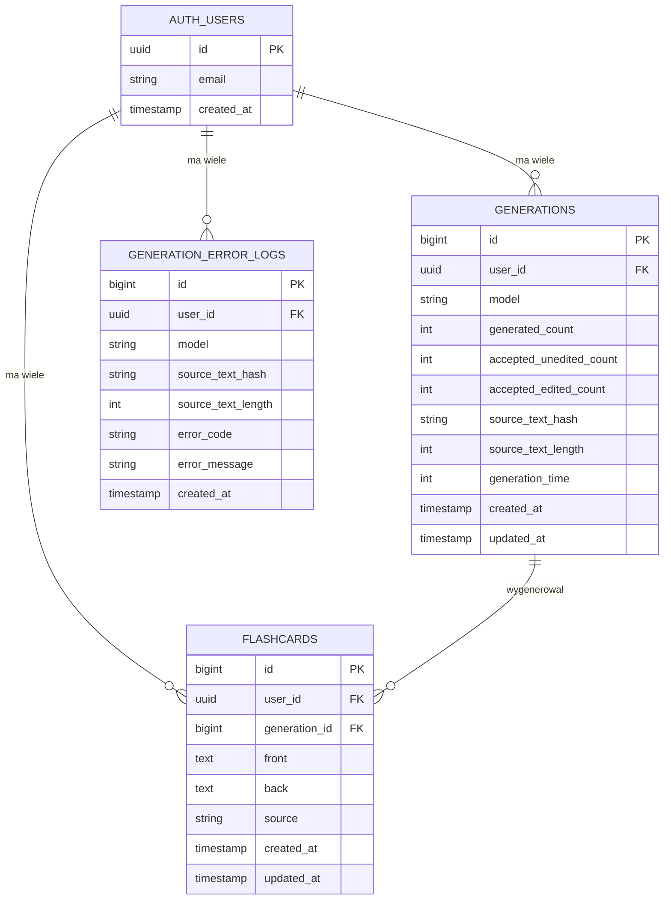

# Schemat bazy danych - 10x-cards

## Diagram ERD



## Opis tabel

### `auth.users` (Supabase Auth)
Tabela zarządzana przez Supabase Auth. Przechowuje podstawowe informacje o użytkownikach.

### `generations`
Przechowuje informacje o sesjach generowania fiszek przez AI.

**Relacje:**
- `user_id` → `auth.users.id` (CASCADE on delete)

**Przypadki użycia:**
- Śledzenie statystyk generowania fiszek
- Analiza skuteczności modeli LLM
- Monitorowanie współczynnika akceptacji fiszek

### `generation_error_logs`
Przechowuje logi błędów podczas generowania fiszek przez AI.

**Relacje:**
- `user_id` → `auth.users.id` (CASCADE on delete)

**Przypadki użycia:**
- Debugowanie problemów z API
- Analiza częstotliwości błędów
- Monitoring jakości usługi

### `flashcards`
Główna tabela przechowująca fiszki.

**Relacje:**
- `user_id` → `auth.users.id` (CASCADE on delete)
- `generation_id` → `generations.id` (SET NULL on delete)

**Wartości `source`:**
- `ai-full` - fiszka zaakceptowana bez modyfikacji
- `ai-edited` - fiszka wygenerowana przez AI i zmodyfikowana przez użytkownika
- `manual` - fiszka utworzona ręcznie przez użytkownika

## Przykładowe zapytania

### 1. Pobierz wszystkie fiszki użytkownika

```sql
SELECT * FROM flashcards
WHERE user_id = auth.uid()
ORDER BY created_at DESC;
```

### 2. Pobierz fiszki z informacją o generacji

```sql
SELECT 
  f.*,
  g.model,
  g.created_at as generation_date
FROM flashcards f
LEFT JOIN generations g ON f.generation_id = g.id
WHERE f.user_id = auth.uid()
ORDER BY f.created_at DESC;
```

### 3. Statystyki generowania dla użytkownika

```sql
SELECT 
  COUNT(*) as total_generations,
  SUM(generated_count) as total_generated,
  SUM(accepted_unedited_count + accepted_edited_count) as total_accepted,
  ROUND(
    100.0 * SUM(accepted_unedited_count + accepted_edited_count) / 
    NULLIF(SUM(generated_count), 0),
    2
  ) as acceptance_rate_percent,
  ROUND(
    100.0 * SUM(accepted_edited_count) / 
    NULLIF(SUM(accepted_unedited_count + accepted_edited_count), 0),
    2
  ) as edit_rate_percent
FROM generations
WHERE user_id = auth.uid();
```

### 4. Statystyki według źródła fiszek

```sql
SELECT 
  source,
  COUNT(*) as count,
  ROUND(100.0 * COUNT(*) / SUM(COUNT(*)) OVER (), 2) as percentage
FROM flashcards
WHERE user_id = auth.uid()
GROUP BY source
ORDER BY count DESC;
```

### 5. Ostatnie błędy generowania

```sql
SELECT 
  error_code,
  error_message,
  model,
  created_at
FROM generation_error_logs
WHERE user_id = auth.uid()
ORDER BY created_at DESC
LIMIT 10;
```

### 6. Historia generowania z liczbą zaakceptowanych fiszek

```sql
SELECT 
  g.id,
  g.model,
  g.generated_count,
  g.accepted_unedited_count,
  g.accepted_edited_count,
  g.generation_time,
  g.created_at,
  COUNT(f.id) as flashcards_in_db
FROM generations g
LEFT JOIN flashcards f ON f.generation_id = g.id
WHERE g.user_id = auth.uid()
GROUP BY g.id
ORDER BY g.created_at DESC;
```

### 7. Najczęściej używane modele LLM

```sql
SELECT 
  model,
  COUNT(*) as usage_count,
  AVG(generation_time) as avg_generation_time_ms,
  AVG(100.0 * (accepted_unedited_count + accepted_edited_count) / 
    NULLIF(generated_count, 0)) as avg_acceptance_rate
FROM generations
WHERE user_id = auth.uid()
GROUP BY model
ORDER BY usage_count DESC;
```

### 8. Fiszki utworzone w ostatnich 7 dniach

```sql
SELECT 
  DATE(created_at) as date,
  COUNT(*) as count,
  source
FROM flashcards
WHERE user_id = auth.uid()
  AND created_at >= NOW() - INTERVAL '7 days'
GROUP BY DATE(created_at), source
ORDER BY date DESC, source;
```

## Funkcje pomocnicze

### Funkcja: Oblicz wskaźnik akceptacji dla użytkownika

```sql
CREATE OR REPLACE FUNCTION get_user_acceptance_rate(p_user_id uuid)
RETURNS numeric AS $$
  SELECT 
    COALESCE(
      ROUND(
        100.0 * SUM(accepted_unedited_count + accepted_edited_count) / 
        NULLIF(SUM(generated_count), 0),
        2
      ),
      0
    )
  FROM generations
  WHERE user_id = p_user_id;
$$ LANGUAGE SQL STABLE;
```

### Funkcja: Pobierz statystyki użytkownika

```sql
CREATE OR REPLACE FUNCTION get_user_stats(p_user_id uuid)
RETURNS TABLE(
  total_flashcards bigint,
  manual_flashcards bigint,
  ai_flashcards bigint,
  total_generations bigint,
  acceptance_rate numeric
) AS $$
BEGIN
  RETURN QUERY
  SELECT 
    (SELECT COUNT(*) FROM flashcards WHERE user_id = p_user_id),
    (SELECT COUNT(*) FROM flashcards WHERE user_id = p_user_id AND source = 'manual'),
    (SELECT COUNT(*) FROM flashcards WHERE user_id = p_user_id AND source IN ('ai-full', 'ai-edited')),
    (SELECT COUNT(*) FROM generations WHERE user_id = p_user_id),
    (SELECT get_user_acceptance_rate(p_user_id));
END;
$$ LANGUAGE plpgsql STABLE;
```

## Polityki bezpieczeństwa (RLS)

Wszystkie tabele mają włączone Row Level Security z politykami zapewniającymi:

1. **Izolacja danych użytkowników** - każdy użytkownik widzi tylko swoje dane
2. **Pełna kontrola** - użytkownicy mogą wykonywać wszystkie operacje CRUD na swoich danych
3. **Automatyczne filtrowanie** - RLS automatycznie filtruje zapytania według `auth.uid()`

### Testowanie RLS

```sql
-- Symuluj użytkownika (wymaga uprawnień superuser)
SET request.jwt.claim.sub = 'user-uuid-here';

-- Sprawdź, czy RLS działa
SELECT * FROM flashcards; -- Powinno zwrócić tylko fiszki danego użytkownika
```

## Migracje

Migracje znajdują się w katalogu `/supabase/migrations/`.

### Zastosowanie migracji

```bash
# Lokalne środowisko
supabase db reset

# Produkcja
supabase db push --linked
```

### Rollback migracji

```bash
# Supabase nie wspiera natywnego rollbacka
# Należy utworzyć nową migrację z operacjami odwrotnymi
supabase migration new rollback_nazwa_migracji
```

## Monitorowanie wydajności

### Sprawdź wolne zapytania

```sql
SELECT 
  query,
  calls,
  total_time,
  mean_time,
  max_time
FROM pg_stat_statements
WHERE query LIKE '%flashcards%'
ORDER BY mean_time DESC
LIMIT 10;
```

### Sprawdź wykorzystanie indeksów

```sql
SELECT 
  schemaname,
  tablename,
  indexname,
  idx_scan as index_scans,
  idx_tup_read as tuples_read,
  idx_tup_fetch as tuples_fetched
FROM pg_stat_user_indexes
WHERE schemaname = 'public'
ORDER BY idx_scan ASC;
```

## Backup i restore

### Backup lokalny

```bash
supabase db dump -f backup.sql
```

### Restore lokalny

```bash
supabase db reset
psql -h localhost -p 54322 -U postgres < backup.sql
```

